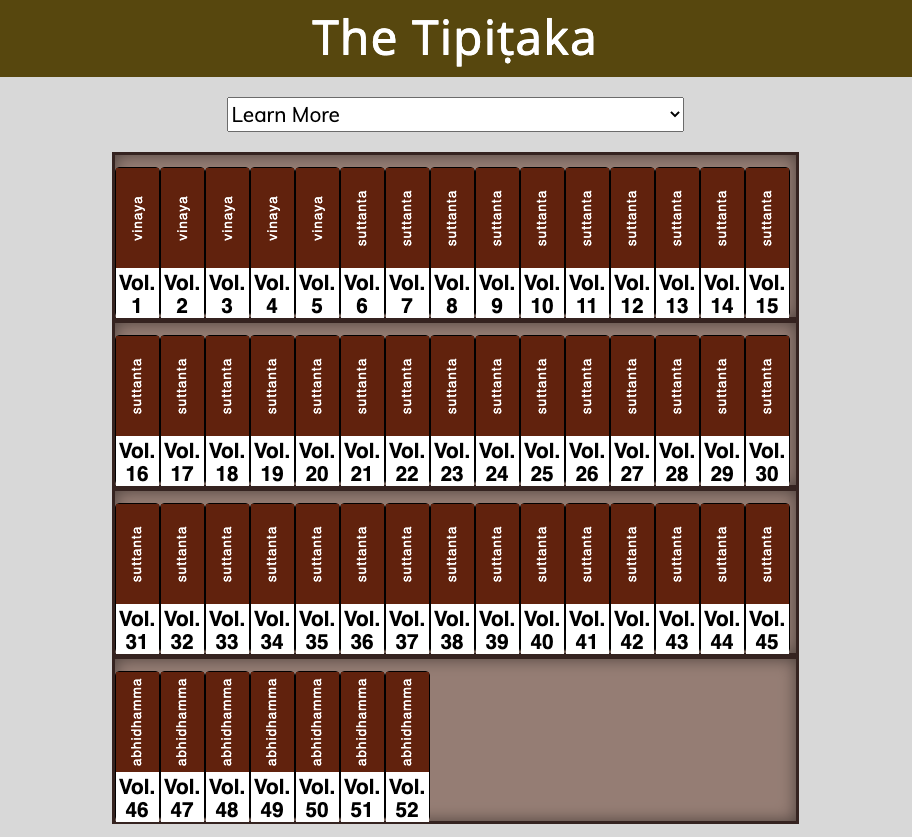

#The Tipi&#7789;aka
#####(A Visual Introduction)
---
######working title: _The Tipi&#7789;aka (A Visual Introduction)_
######author: Rebecca & Steve Hanlon
######date: Aug 1, 2020
---

###App Overview
This app gives a visual introduction and explanation of the Tipi&#7789;aka's 50 volumes as well as the commentaries and subcommentaries about the Tipi&#7789;aka.  

The volumes and commentaries are layed out on virtual bookshelves with clickable books to get more information about each volume or work.  

A menu will also allow you to select whole sections (i.e. the whole suttanta or vinaya) or quickly locate popular volumes such as the _Dhammapada_ or _J&#257;taka Tales_ to see where they occur in the whole Tipitaka or such as the _The Path of Purification_ in the commentaries.

The app will also come with an animated short introduction to the Tipi&#7789;aka that can be started with the click of a button.

### UI
-  __Bookshelves__ - one for Tipitaka and other shelves for Commentaries and Subcommentaries
- __Books__ - when clicked on reveal modal windows with information about the volume.
- __Menu__ - to select sections or works which then show on the bookshelves where these sections or shorter, popular works are located.
- __Intro-Button__ - will initiate a short animation giving an introduction to the Tipi&#7789;aka

 

**The Tipi&#7789;aka (A Visual Introduction)** 

[Online workspace at CodePen](https://codepen.io/SixStringsCoder/pen/6887a6d9c1d9a4978ef70ad80586d343)
